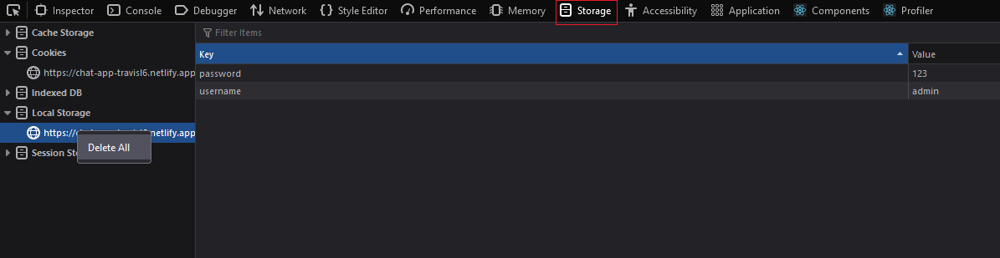

# Getting Started

## Hard-coded usernames and passwords - Plan to add Log out and Sign up function later
admin
123

johndoe
123

willy
123

## Trying other users

As there is no log out feature yet, you will have to remove the local storage in order to simulate logging out so you can return to the log in screen.

To do this, while on the website press F12 to open your web browser's console and navigate to storage and clear it.

Firefox example:

# To Do

Change UI of chat screen

Change UI of login screen

Add Sign Up and Sign Out functionality

# Tools used
ChatEngine: https://chatengine.io/

Axios: https://axios-http.com/

Ant Design icons: https://ant.design/

Netlify: https://www.netlify.com/
